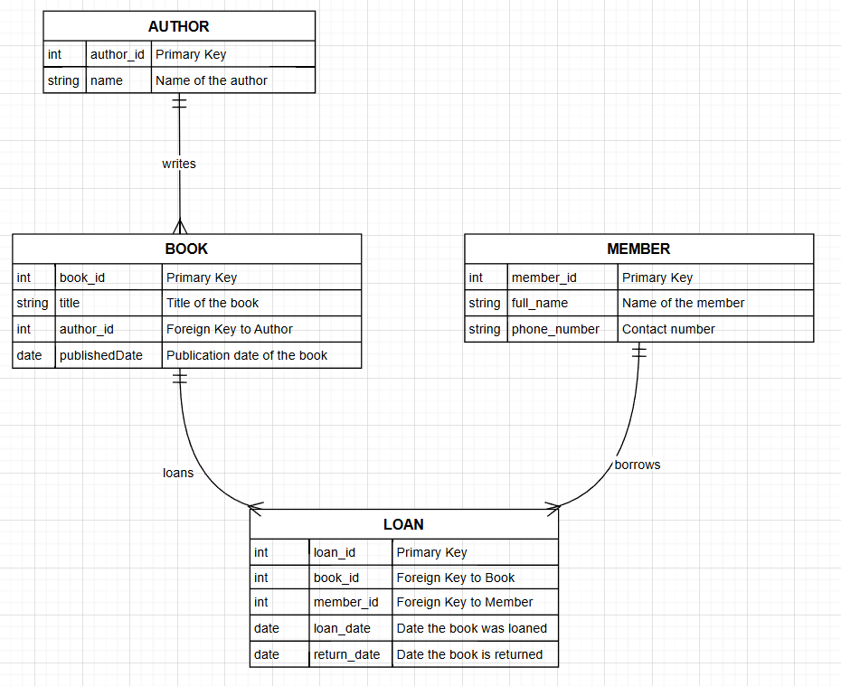

# Library Management Database

This repository contains the SQL schema and ER diagram for a simple **Library Management System** as part of my SQL Developer Internship task.

## 📂 Contents
- `schema.sql`: SQL DDL to create the database schema.
- `er-diagram.png`: ER diagram showing the entities and relationships.
- `README.md`: Project overview and setup instructions.

## 🎯 Objective
Design a normalized relational database schema including primary/foreign keys and create an ER diagram.

## 🧠 Domain
**Library Management** with the following entities:
- **Authors** (each author writes many books)
- **Books** (each book has one author)
- **Members** (users who borrow books)
- **Loans** (each loan references one book and one member)

## 📐 ER Diagram


## 🧪 Getting Started
1. Clone this repository:
   ```bash
   git clone https://github.com/codytech05/library-management-database.git
   
2. Create the database and tables:
   mysql -u your_user -p < schema.sql
   
3. Explore the ER diagram for structure and relationships.

🎓 Key Concepts Demonstrated
   DDL (Data Definition Language): CREATE TABLE statements
   Normalization: Third normal form achieved
   Primary & Foreign Keys: Enforced for data integrity
   Relationships: One-to-many

💬 Interview Prep
You can also prepare for these common questions:
    What is normalization?
    Explain primary vs foreign key
    What are constraints?
    What is a surrogate key?
    What is an ER diagram?
    What is AUTO_INCREMENT?

Your ERD will have:
- 1:N from `Authors → Books`
- 1:N from `Members → Loans`
- 1:N from `Books → Loans`

---

### 🎯 **Next Steps**:
✅ Copy this `README.md`.  
✅ Save the `schema.sql` as previously discussed.  
✅ Draw the ER diagram using any tool you like (Draw.io, MySQL Workbench, etc.), export as `er-diagram.png`.  
✅ Push everything to your new GitHub repository.  
✅ Fill the Google Form submission link provided.
